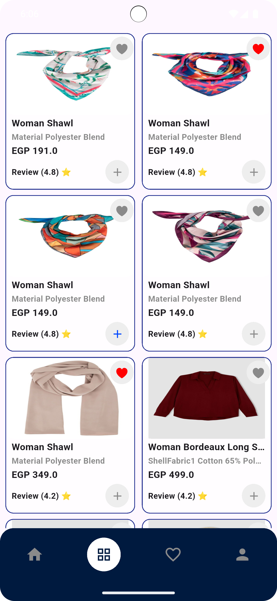
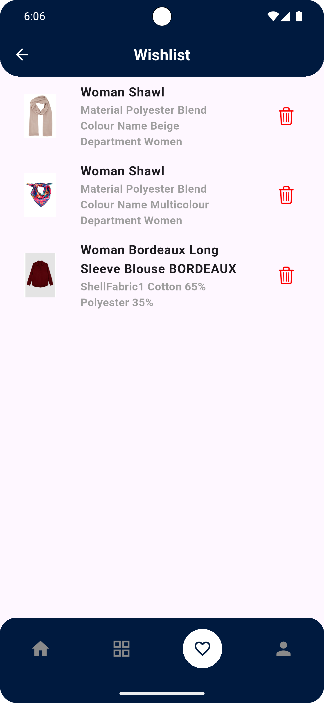
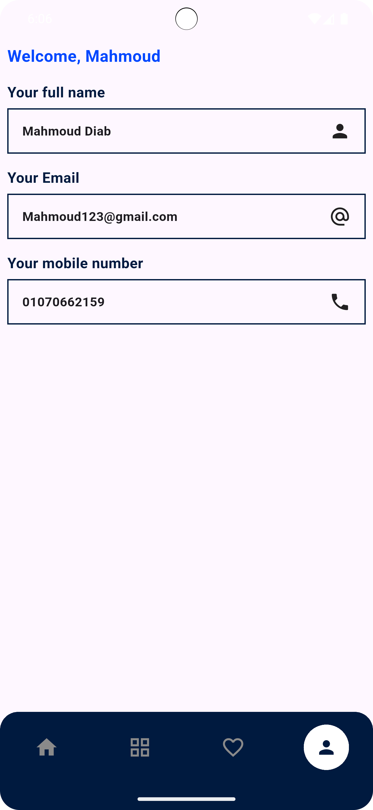
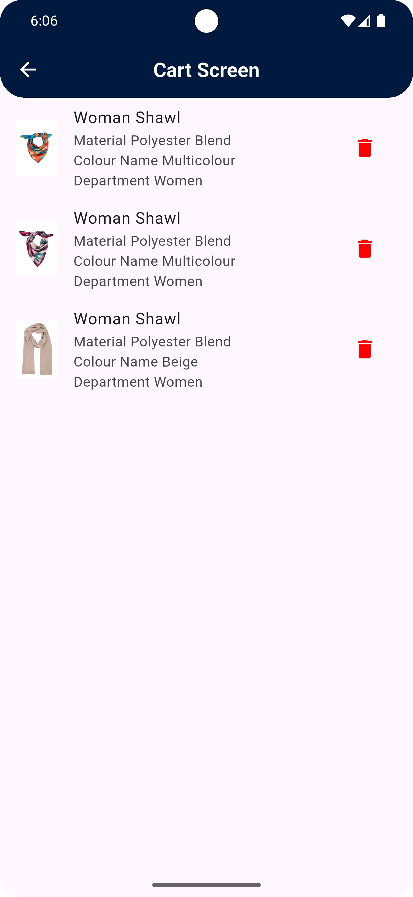

## ecommerce app

📸 Screenshots

  
  
  
  
  
  
  
  

## 🌟 Overview

A flutter ecommerce app is a mobile application built using the Flutter framework that enables users to browse, search, and purchase products online.
It typically integrates with a backend (REST API) to handle products, categories, brands , users, and payments.

🔑 Core Features

1. Authentication
   Sign up / Sign in (email, phone, Google, Facebook, etc.)
   Secure token-based authentication (JWT, Firebase Auth, etc.)
   Profile management (update name, email, password, address).
2. Home Screen
   Featured products & banners (carousel).
   Product categories & brands (electronics, fashion, groceries, etc.).
   Recommendations & top-selling products.
3. Product Listing
   Display products with images, title, price, rating, and discount.
   Sorting (price low → high, popularity, latest).
   Filtering (category, brand, rating, price range).
4. Product Details
   Multiple images of the product.
   Description, specifications, reviews.
   Add to cart / Buy now.
5. Cart & Checkout
   Add, update, remove items from the cart.
   Checkout with payment options (Cash on Delivery, Stripe, PayPal, etc.).
6. Favorites / Wishlist
   Save products to wishlist.
   Quick access to favorite items.

## Main packages used

1. dio to make integration with API
2. flutter_bloc as state management
3. shared_preferences to handle caching data
4. internet_connection_checker to handle internet connection
5. get_it to make dependency injection
6. dartz to Functional programming in Dart
7. equatable to Simplify Equality Comparisons

